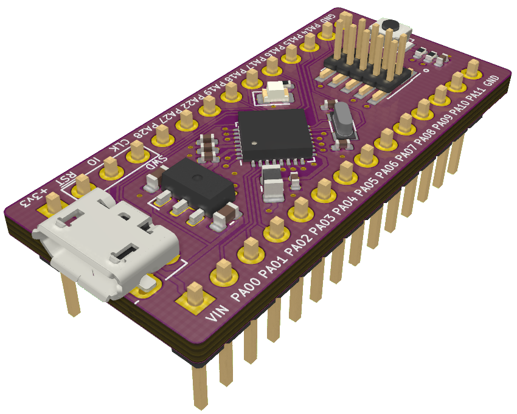

# atsamd21e18a Breakout Board

## About

This is a breadboardable breakout board for the Atmel SAMD21 32-bit ARM microcontroller.

* 32-pin Atmel SAMD21 microcontroller (`atsamd21e18a`).
* 18 IOs exposed.
* Direct USB interface.
* 10-pin 1.27mm SWD header.
  * SWD signals exposed via 2.54mm.
* On-board reset button.
* On-board 32.768 kHz crystal.

