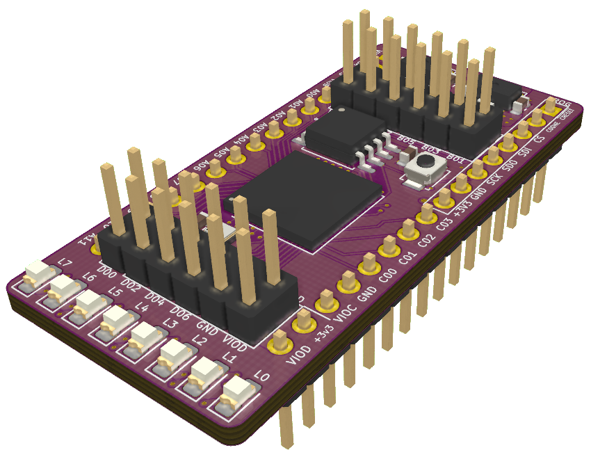

# ice40hx8k-bg121 Breakout Board

## About

This is a breadboardable breakout board for a Lattice iCE40HX8K FPGA.

* Four IO banks with 32 exposed IOs
  * 12 + 4 breadboardable IO
  * 8 + 8 IO via 2.54mm headers
  * Eight on-board LEDs (Bank D)
* Settable VIO for IO Banks A, B, and D.
* 12-pin PMOD compatible pinout for IO banks B and D.
* 6-pin PMOD compatible pinout for IO bank C.
* On-board 2Mbit flash memory.
* On-board 12MHz clock source.
* On-board reset button.

*This board does **not** contain programming circuitry. The [`ft2232h-ice40` breakout](https://github.com/jkiv/kicad-breakouts/tree/main/boards/ft2232h-ice40) is intended to provide the programming circuitry for this board.*

## Rationale

This board began with the intent to provide a breadboardable FPGA for educational purposes.
